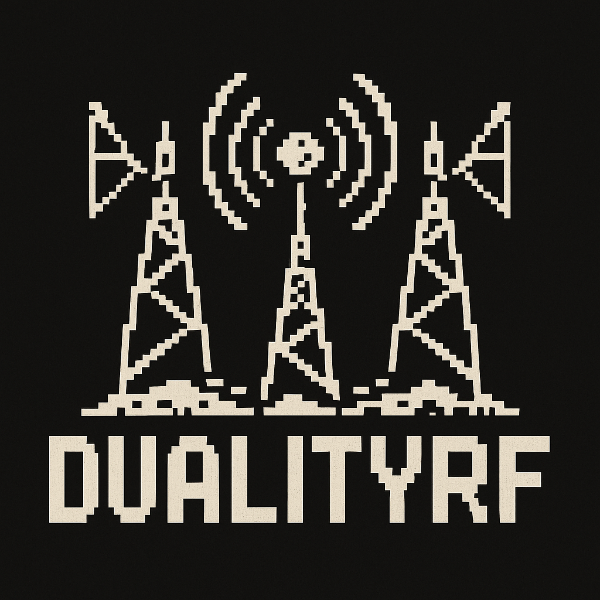

<p align="center">
  
</p>

# DualityRF

A local desktop SDR laboratory built with Qt 6, C++20, SoapySDR and FFTW.
Record, visualize, analyze and replay IQ sample streams from any
SoapySDR-compatible device (RTL-SDR, HackRF, ADALM-PLUTO, LimeSDR, BladeRF,
…). Fully offline: all data lives in local session directories.

## Features

- Runtime discovery of SoapySDR hardware, classified as receive-capable,
  transmit-capable or full duplex — no vendor-specific logic outside the
  adapter layer.
- Recording stages with configurable frequency, sample rate, bandwidth,
  gains, duration and trigger mode; monitor mode for tuning before
  committing a recording.
- Live FFT spectrum (zoom, pan, peak hold) and scrolling waterfall,
  processed off the UI thread.
- Optional concurrent transmission during capture: white/Gaussian noise,
  CW, offset sine or a user-supplied IQ waveform.
- Structured sessions (`Sessions/Session_YYYY-MM-DD_HH-MM-SS/`) with
  `recording_NNN.iq` (cs16), `metadata.json`, `session.json` and an
  `fft.cache` of average spectra.
- Playback of any recording through a selected transmitter with frequency,
  gain, rate, repeat and speed controls.
- Debug workspace: A/B comparison of recordings with overlaid FFTs, offline
  waterfall, side-by-side metadata, occupied bandwidth (99 %), mean/peak
  power and peak offset measurements.
- Monochrome, touch-friendly UI with dockable panels; below 960 px the
  layout stacks vertically for small/portrait screens. Portable to
  ARM/Raspberry Pi.

## Getting started

### Prerequisites

You need a C++20 compiler (GCC 12+/Clang 15+), CMake ≥ 3.21, Ninja and the
following libraries:

| Dependency | Purpose |
|---|---|
| **Qt 6** (Widgets) | user interface |
| **SoapySDR** | vendor-neutral SDR hardware access |
| **FFTW3** (single precision) | FFT engine for spectrum/waterfall |
| **SoapyHackRF** | SoapySDR driver module for HackRF |
| **SoapyRTLSDR** | SoapySDR driver module for RTL-SDR |

SoapySDR alone only provides the API — you also need the driver module for
each device family you want to use. HackRF and RTL-SDR are the tested
targets; any other SoapySDR module (PlutoSDR, LimeSDR, BladeRF, …) should
work the same way.

#### Arch Linux

```sh
sudo pacman -S --needed base-devel cmake ninja qt6-base fftw soapysdr \
    soapyhackrf soapyrtlsdr
```

#### Debian / Ubuntu

```sh
sudo apt install build-essential cmake ninja-build qt6-base-dev \
    libfftw3-dev libsoapysdr-dev soapysdr-tools \
    soapysdr-module-hackrf soapysdr-module-rtlsdr
```

### Verify your hardware

Before building, check that SoapySDR sees your devices:

```sh
SoapySDRUtil --find
```

Each connected device should show up with its driver (`driver=hackrf`,
`driver=rtlsdr`, …). If a device is missing, its SoapySDR module is not
installed or udev denies access — on most distributions adding yourself to
the `plugdev`/`dialout` group or installing the `hackrf`/`rtl-sdr` udev
rules fixes the latter.

### Build

The project uses CMake presets (Ninja generator):

```sh
git clone https://github.com/Forsrobin/DualityRF.git
cd DualityRF
cmake --preset release
cmake --build --preset release
```

Use the `debug` preset for development builds (symbols, no optimization):

```sh
cmake --preset debug
cmake --build --preset debug
```

### Run

```sh
./build/release/src/duality_rf
```

Sessions and recordings are written to local `Sessions/` directories; no
network access is used.

## Contributing

Bug reports, hardware compatibility notes, features and documentation are
all welcome:

- Open bugs and feature requests on the
  [issue tracker](https://github.com/Forsrobin/DualityRF/issues).
- To contribute code, fork the repository, create a feature branch and open
  a pull request. Please keep changes buildable with the `release` preset.
- The design documents in [docs/](docs/) are the best starting point for
  understanding the codebase.

## Documentation

Design documents live in [docs/](docs/):
[architecture](docs/ARCHITECTURE.md) · [threading](docs/THREADING.md) ·
[storage format](docs/STORAGE.md) · [UI design](docs/UI.md) ·
[implementation plan](docs/IMPLEMENTATION_PLAN.md).

## Layout

```
src/core      shared types, SPSC ring buffer (header-only)
src/sdr       ISDRDevice/IReceiver/ITransmitter, DeviceManager, SoapySDR adapter
src/dsp       FFT engine, windows, spectrum processing, waveform generators
src/storage   sessions, IQ file I/O (cs16/cf32 + .C16 import), fft cache
src/pipeline  capture / playback / concurrent-TX pipelines
src/ui        Qt Widgets front end
samples/      example capture (PortaPack .C16 + sidecar)
```
