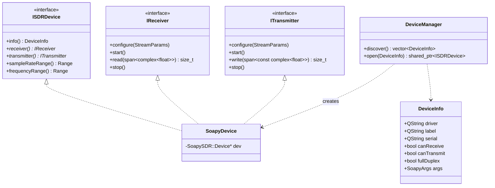

# DualityRF — Architecture

DualityRF is a local desktop SDR laboratory application built with Qt 6, C++20,
SoapySDR and FFTW. It records, visualizes, analyzes and replays IQ sample
streams from any SoapySDR-compatible device. It never talks to the network;
all data lives in local session directories.

## Design principles

1. **Hardware independence.** The application core knows only the interfaces
   in `src/sdr/`. Vendor specifics live exclusively behind the SoapySDR
   adapter; new hardware arrives via new adapters, never via changes to the
   core.
2. **DSP is decoupled from UI.** Sample processing runs on worker threads and
   hands the UI finished, downsampled artifacts (spectrum rows in dB). The UI
   never touches raw sample streams.
3. **Modular static libraries.** Each layer is a CMake target with explicit,
   one-directional dependencies. Lower layers never include Qt Widgets.
4. **ARM portability.** No x86 intrinsics, no assumption about GPU; waterfall
   rendering is a plain QImage scroll; FFT sizes and averaging are
   configurable to fit a Raspberry Pi.

## Module dependency diagram

```
                ┌─────────────────────────────┐
                │        duality_rf (app)     │
                │        src/main.cpp         │
                └──────────────┬──────────────┘
                               │
                ┌──────────────▼──────────────┐
                │          duality_ui         │   Qt Widgets
                │  MainWindow, panels, views  │
                └───┬──────────┬──────────┬───┘
                    │          │          │
        ┌───────────▼──┐  ┌────▼─────┐  ┌─▼──────────────┐
        │ duality_     │  │ duality_ │  │ duality_       │
        │ pipeline     │  │ storage  │  │ dsp            │
        │ Capture/     │  │ Sessions,│  │ FFT, windows,  │
        │ Playback/    │  │ IQ files,│  │ waveform gen,  │
        │ Transmit     │  │ metadata │  │ measurements   │
        └───┬──────┬───┘  └────┬─────┘  └─┬──────────────┘
            │      │           │          │
   ┌────────▼─┐  ┌─▼───────────▼──────────▼─┐
   │ duality_ │  │        duality_core      │   Qt Core only
   │ sdr      │  │ Types, RingBuffer, Log   │
   │ (Soapy)  │  └──────────────────────────┘
   └──────────┘
```

Allowed include directions (→ = "may depend on"):

```
ui → pipeline, storage, dsp, sdr, core
pipeline → sdr, dsp, storage, core
storage → core
dsp → core
sdr → core
core → (Qt6::Core, std only)
```

External dependencies per module:

| Module            | Qt6            | SoapySDR | FFTW3f |
|-------------------|----------------|----------|--------|
| duality_core      | Core           | –        | –      |
| duality_sdr       | Core           | yes      | –      |
| duality_dsp       | Core           | –        | yes    |
| duality_storage   | Core           | –        | –      |
| duality_pipeline  | Core           | (via sdr)| (via dsp) |
| duality_ui / app  | Core, Gui, Widgets | –    | –      |

## SDR abstraction design



- **Classification** happens in `DeviceManager::discover()`: a device with
  ≥1 RX channel is receive-capable, ≥1 TX channel transmit-capable, both →
  full duplex. No driver names are ever tested outside the adapter.
- `StreamParams` (core) carries frequency, sample rate, bandwidth and gain —
  the only configuration vocabulary the app uses.
- One `SoapyDevice` instance owns the `SoapySDR::Device` handle and exposes
  its RX side as `IReceiver` and TX side as `ITransmitter`; the pipelines
  only ever see the interface they need.

## DSP pipeline

```
IReceiver::read()                     UI thread
  (RX worker thread)                     ▲
      │  raw complex<float> chunks       │ queued Qt signals
      ▼                                  │ (QVector<float> dB rows)
 SpscRingBuffer  ──────►  SpectrumProcessor (worker thread)
      │                     window (Hann) → FFT (FFTW) → |X|² → dB
      ▼                     → exponential averaging → fftshift
 IqFileWriter (when recording)
```

- The ring buffer is a lock-free single-producer/single-consumer float-complex
  buffer; the RX thread never blocks on the DSP side (overruns drop display
  data, never recording data — the file write happens on the RX side path
  through a buffered writer).
- `SpectrumProcessor` produces `fftSize`-bin rows at a bounded rate
  (default ≤ 30 rows/s) so the UI cost is constant regardless of sample rate.

## Recording pipeline

```
CapturePipeline::start(receiver, StreamParams, RecordingPlan)
  RX thread loop:
      read chunk ──► ring buffer (live spectrum)
                 └─► IqFileWriter (cs16, buffered)   [if recording]
  on duration reached / manual stop:
      writer.finalize() → RecordingMetadata → Session::addRecording()
      → average spectrum appended to fft.cache
```

A capture can run in *monitor* mode (no file) for tuning before committing a
recording stage. Optional concurrent transmission runs an independent
`TransmitPipeline` (waveform generator → ITransmitter) on its own thread.

## Playback pipeline

```
PlaybackPipeline::start(transmitter, file, PlaybackParams)
  TX thread loop:
      IqFileReader::read chunk → convert to cf32 → ITransmitter::write
      at EOF: repeat ? seek(0) : stop
```

Playback speed is realized by scaling the device output sample rate
(`rate × speed`) where the hardware supports it; the recording itself is
never resampled, preserving fidelity.

## Threading model

See [THREADING.md](THREADING.md).

## Storage format

See [STORAGE.md](STORAGE.md).

## UI

See [UI.md](UI.md).

## CMake structure

```
CMakeLists.txt              project, C++20, find_package(Qt6/SoapySDR/FFTW)
src/CMakeLists.txt          adds module subdirectories + app target
src/core/CMakeLists.txt     duality_core     (STATIC)
src/sdr/CMakeLists.txt      duality_sdr      (STATIC)
src/dsp/CMakeLists.txt      duality_dsp      (STATIC)
src/storage/CMakeLists.txt  duality_storage  (STATIC)
src/pipeline/CMakeLists.txt duality_pipeline (STATIC)
src/ui/CMakeLists.txt       duality_ui       (STATIC)
```

Each target uses `target_link_libraries` with visibility keywords and
`target_include_directories(<t> PUBLIC src/)` so includes are written as
`#include "sdr/IReceiver.h"` — the include path encodes the module.
`CMakePresets.json` keeps the existing `debug`/`release` Ninja presets.
